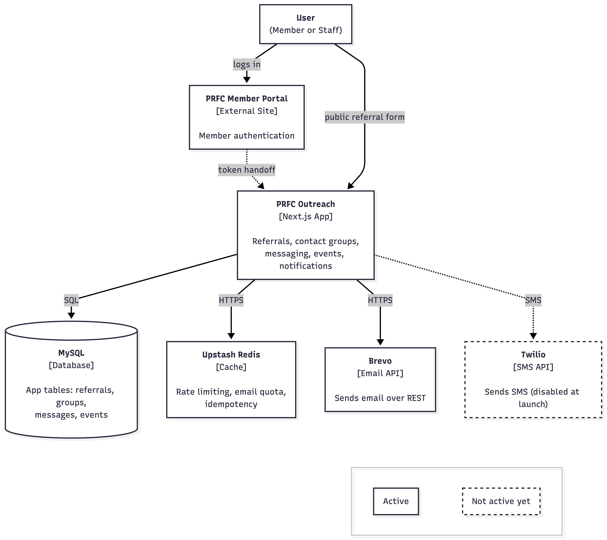
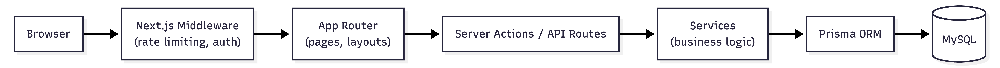

# Architecture

PRFC Connect is a Next.js application that handles member referrals and will expand to support contact groups with email and SMS messaging.

## System Diagram



## Tech Stack

| Layer         | Technology     | Purpose                      |
| ------------- | -------------- | ---------------------------- |
| Framework     | Next.js 15     | App Router, server rendering |
| UI            | React 19       | Components                   |
| Language      | TypeScript     | Type safety                  |
| Database      | MySQL + Prisma | Data storage and ORM         |
| Styling       | Tailwind CSS   | Utility classes              |
| Components    | shadcn/ui      | Pre-built UI primitives      |
| Validation    | Zod            | Runtime type checking        |
| Email         | Nodemailer     | SMTP delivery (Resend relay) |
| Rate Limiting | Upstash Redis  | Request throttling           |

**Planned Additions (Contact Groups):**

| Layer           | Technology              | Purpose                    |
| --------------- | ----------------------- | -------------------------- |
| SMS             | Twilio                  | A2P 10DLC compliant SMS    |
| List Rendering  | @tanstack/react-virtual | Handle 400+ member lists   |
| Fuzzy Search    | fuse.js                 | Client-side member search  |
| Email Templates | React Email             | Type-safe email components |

## Request Flow



## Key Patterns

### Server Actions for Mutations

Form submissions use Server Actions instead of API routes. They're co-located with forms and handle validation, database writes, and redirects.

```
src/actions/referral.ts  -> handles form submission
src/services/referral.ts -> business logic
src/lib/db.ts            -> database connection
```

### API Routes

**Current:**

- `POST /api/referral` - External referral creation
- `GET /api/referral` - Admin database access (requires admin session)
- `POST /api/checksum` - Referral code validation

**Upcoming (Contact Groups):**

| Endpoint                   | Method         | Purpose                          |
| -------------------------- | -------------- | -------------------------------- |
| `/api/groups`              | GET/POST       | List/create groups               |
| `/api/groups/[id]`         | GET/PUT/DELETE | Single group operations          |
| `/api/groups/[id]/members` | GET/POST       | Manage group members             |
| `/api/messages`            | POST           | Send message to group            |
| `/api/unsubscribe/[token]` | GET/POST       | One-click email unsubscribe      |
| `/api/webhooks/email`      | POST           | Resend bounce/complaint webhooks |
| `/api/webhooks/sms`        | POST           | Twilio delivery status webhooks  |

### Token Authentication

Users authenticate through the PRFC member portal, which generates a signed token on click-through:

```
ownerid|isAdmin|timestamp|hmac_signature
```

- `ownerid`: Member ID from PRFC portal
- `isAdmin`: `1` for admin, `0` for regular member
- `timestamp`: Token creation time (60-minute expiry)
- `hmac_signature`: 32-bit HMAC with shared secret

The token arrives via POST to `/auth/callback`, gets validated, and stored in an httpOnly cookie.

During development, `/dev/mock-portal` simulates the PRFC portal login flow.

### Data Access Layer (DAL)

Auth validation happens in the DAL, not middleware. Middleware only checks cookie presence as an optimization.

```typescript
// lib/dal.ts
export const verifySession = cache(async () => {
  const token = cookies().get("prfc_auth")?.value;
  // Verify HMAC signature and expiry
  return { ownerid, isAdmin };
});

export async function requireAdmin() {
  const session = await verifySession();
  if (!session.isAdmin) throw new AppError("FORBIDDEN", "...");
  return session;
}
```

Defense-in-depth: middleware redirects help UX, but the DAL is the true security boundary.

## Directory Structure

```
src/
├── app/               # Pages and API routes
│   ├── (public)/      # Public routes
│   ├── (protected)/   # Auth-required routes
│   └── api/           # API endpoints
├── actions/           # Server Actions
├── components/        # React components
│   └── ui/            # shadcn/ui primitives
├── hooks/             # Custom React hooks
├── lib/               # Core utilities
│   ├── db.ts          # Prisma client
│   ├── dal.ts         # Data Access Layer (session validation)
│   ├── csrf.ts        # CSRF protection
│   ├── idempotency.ts # Duplicate request prevention
│   ├── rate-limit.ts  # Request throttling
│   └── utils.ts       # Tailwind class merging
├── schema/            # Zod validation schemas
├── services/          # Business logic
└── utils/             # Helper functions
```

## Database

### Current: Referral

```prisma
model Referral {
  id            Int      @id @default(autoincrement())
  memberName    String
  memberEmail   String
  prospectName  String
  prospectEmail String
  referralCode  String
  redeemed      Boolean  @default(false)
  createdAt     DateTime @default(now())
  updatedAt     DateTime @updatedAt
}
```

### Upcoming: Contact Groups

Six models will be added for Contact Groups with email/SMS messaging:

| Model                | Purpose                                          |
| -------------------- | ------------------------------------------------ |
| `ContactGroup`       | Group metadata (name, description, owner)        |
| `ContactGroupMember` | Membership with notification preferences         |
| `SmsConsent`         | TCPA-required consent records (5-year retention) |
| `EmailSuppression`   | Hard bounces, complaints, unsubscribes           |
| `Message`            | Message history with delivery counts             |
| `MessageRecipient`   | Per-recipient delivery status tracking           |

**Compliance Requirements:**

- **SMS (TCPA + A2P 10DLC):** Double opt-in, quiet hours (8 AM - 9 PM), 5-year consent retention
- **Email (CAN-SPAM):** One-click unsubscribe, physical address required
- **Retention:** Messages 3 years, consent 5 years, members duration + 3 years

## Security

- **Rate limiting** via Upstash Redis on all endpoints
- **CSRF protection** for state-changing requests
- **Idempotency keys** prevent duplicate submissions
- **Zod validation** on all inputs
- **Security headers** set in `next.config.js` (CSP, HSTS, X-Frame-Options)

## Related Docs

- [Getting Started](getting-started.md) - Local setup
- [Contributing](contributing.md) - Development workflow
- ADRs in `decisions/` - Why we made specific choices
