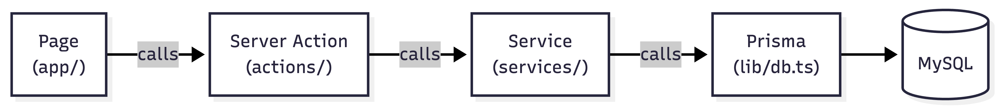

# Source Directory

## Structure

```
src/
├── app/              # Next.js App Router (pages + API routes)
│   ├── (public)/     # No auth required (referral form, unsubscribe, terms)
│   ├── (protected)/  # Auth required (home, groups, events, messages, settings)
│   └── api/          # API endpoints
├── actions/          # Server Actions ("use server")
├── components/       # React components, grouped by feature
│   ├── ui/           # shadcn/ui primitives
│   ├── layout/       # Header, sidebar, navigation
│   └── ...           # referral, groups, events, messages, dashboard, profile, settings
├── config/           # Static config (navigation)
├── generated/        # Prisma client (auto-generated)
├── hooks/            # Generic shared React hooks
├── lib/              # Server integrations (db, dal, encryption, rate-limit, csrf, ...)
├── schema/           # Zod validation schemas
├── services/         # Business logic (server-only, Prisma access)
├── types/            # Shared interfaces that cross layers (isomorphic)
├── utils/            # Pure helper functions and constants
├── env.ts            # Environment variable validation (Zod)
└── proxy.ts          # Next.js 16 proxy (cookie gate for protected paths)
```

## Naming

Files and folders use `kebab-case`.

## How Things Connect



Zod schemas in `schema/` validate data at each layer, and their types come from `z.infer`. Plain interfaces that cross layers (services to actions to components) live in `types/`, which holds no runtime code. In short: `schema/` for anything validated, `types/` for shared shapes.

## Route Groups

Parentheses create route groups without affecting the URL:

- `(public)/` - No auth required
- `(protected)/` - Auth required

Both render at their actual path: `(protected)/referral-database` -> `/referral-database`.
